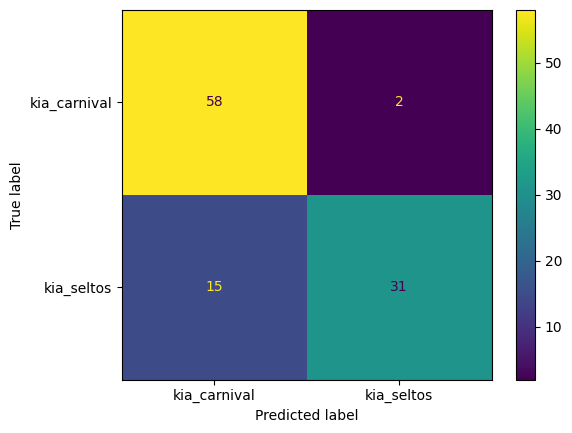
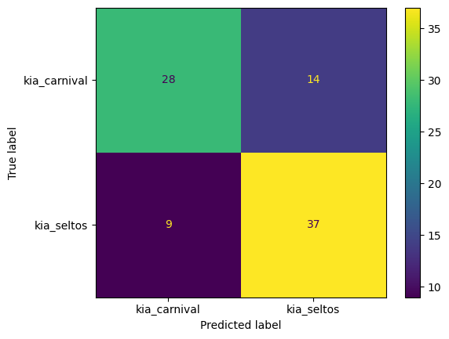
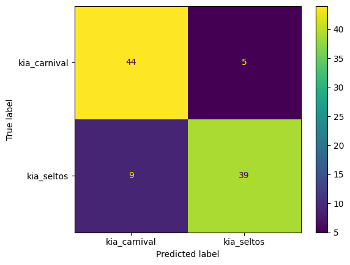
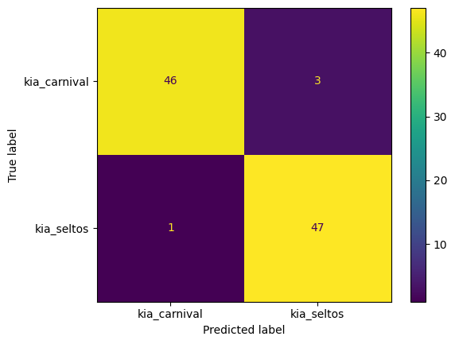

# v0
This version automobile_classifier_v0 will classify the given photo into one of this:
- autorikshaw
- bike
- car
- fighterjet
- tank
- truck

This was a testing version to test out ResNet50 on my own. The classes are very different from each other so training needed and data quality needed is low.

# v1
The automobile_classifier_v1 will focus on KIA models seltos and carnival only
- The goal is to predict the KIA models with 90%+ accuracy. 

- The main task?
    - The dataset has to be very clean, with no noise, and no faulty data.
    - The classification classes are going to be very close as KIA follows similar designs among cars.

First run: 

- Carnival dataset had many U.S.A. variants of the carnival which looks very different from the Indian
- image size was set 

Second run:

- Seltos dataset had noise -> CLEARED

Third run: 

- Image size was changed to 384, and batch size to 32
- 20 epochs trained

Final Run:

- Increased the image size to 500, batch size to 64
- 20 epochs
- Dataset was highly cleaned - 400 to 500 images per class